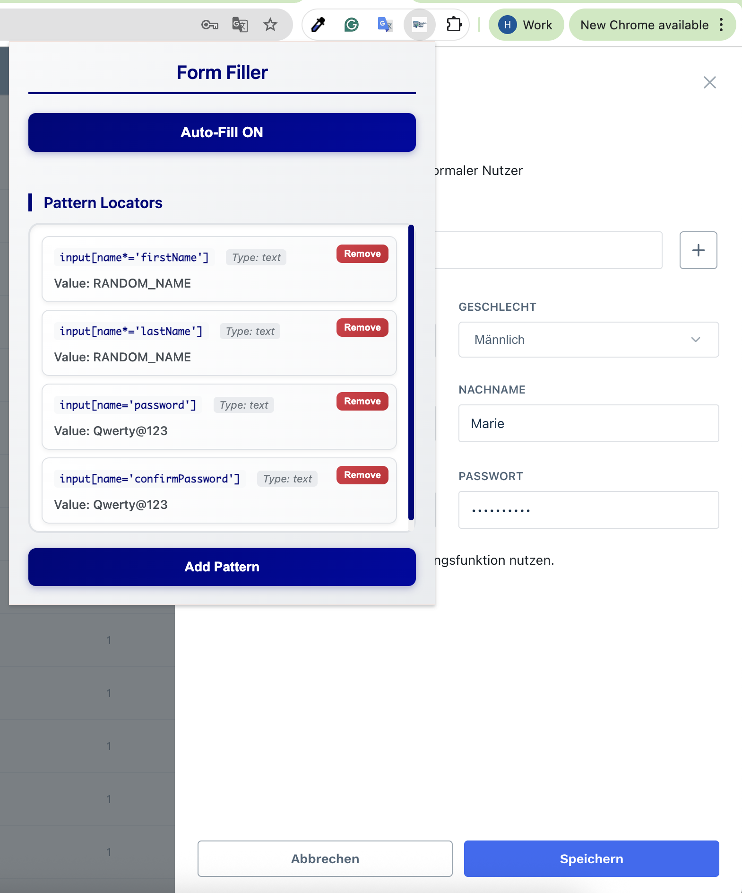
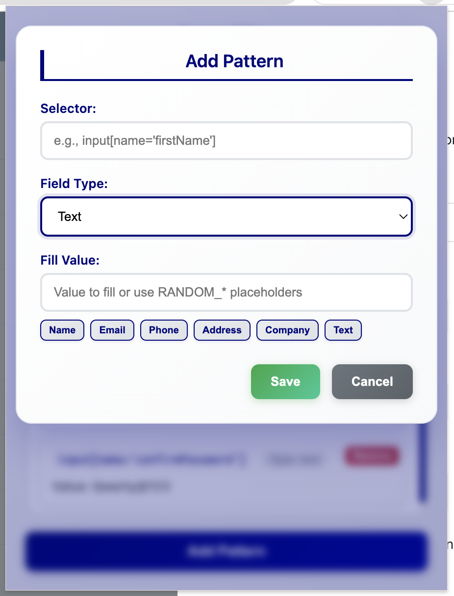

# Random Form Filler

A Chrome extension that automatically fills web forms with random data.

## Installation

1. Go to the [Releases page](../../releases)
2. Download the latest `random-form-filler-v*.zip` file
3. Extract the ZIP file
4. Open Chrome and go to `chrome://extensions/`
5. Enable "Developer mode" (toggle in top right)
6. Click "Load unpacked" and select the extracted folder

## Usage

1. Click the extension icon in your browser toolbar
2. Toggle "Auto-Fill ON" to enable automatic form filling
3. Visit any website with forms - they'll be filled automatically with random data

## Features

- Automatically fills forms with random names, emails, addresses, and phone numbers
- Works with text inputs, checkboxes, dropdowns, and radio buttons
- Add custom patterns for specific websites
- Toggle on/off as needed

## Privacy

This extension works completely offline and doesn't collect or send any data.